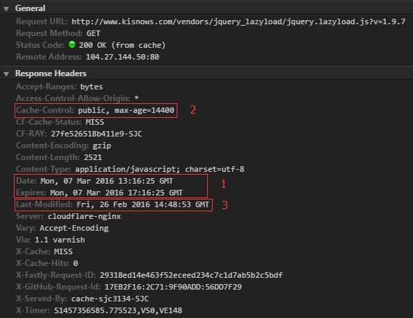

# HTTP 控制缓存主要有一下几种方式：
  1. Expires
  2. Cache-Control
  3. Last-Modified/If-Modified-Since
  4. Etag/If-None-Match

## Expires

过期时间，有点类似于 cookies 里面的 Expires。可以在 header 中设置一个具体的过期时间，在这个过期时间内，浏览器都不会向服务器请求这个文件，会直接存本地的缓存中读取。

需要注意的是，Expires 是 HTTP 1.0 的东西，现在绝大多数浏览器都默认使用 HTTP 1.1，所以用 Expires 控制缓存不是首选的方法。

## Cache-control

Cache-control 与 Expires 作用基本相同，都是标志出当前资源的有效期，以此来控制浏览器是使用本地缓存还是从服务器重新获取资源。不过，不同的地方在于，Cache-control 能够控制的更加细致，当header中同时存在 Expires 时，Cache-control 的优先级要更高一些。

HTTP协议头 Cache-Control 的值可以是 public、private、no-cache、no- store、no-transform、must-revalidate、proxy-revalidate、max-age

各个消息中的指令含义如下：
  - Public 指示响应可被任何缓存区缓存。
  - Private 指示对于单个用户的整个或部分响应消息，不能被共享缓存处理。这允许服务器仅仅描述当用户的部分响应消息，此响应消息对于其他用户的请求无效。
  - no-cache 指示请求或响应消息不能缓存
  - no-store 用于防止重要的信息被无意的发布。在请求消息中发送将使得请求和响应消息都不使用缓存。
  - max-age 指示客户机可以接收生存期不大于指定时间（以秒为单位）的响应。
  - min-fresh 指示客户机可以接收响应时间小于当前时间加上指定时间的响应。
  - max-stale 指示客户机可以接收超出超时期间的响应消息。如果指定max-stale消息的值，那么客户机可以接收超出超时期指定值之内的响应消息。

## Last-Modified/If-Modified-Since
  1. Last-Modified 表示这个资源的最后修改时间，服务器在相应请求时，会告诉浏览器此资源的最后修改时间。
  2. If-Modified-Since 发送HTTP请求时，浏览器会把缓存资源的最后修改时间一起发送到服务器去，服务器会用这个时间与服务器上实际文件的最后修改事件进行对比。如果时间一致，则返回 HTTP 状态码 304，浏览器接收到后会直接显示缓存的文件。如果时间不一致，则返回 HTTP 状态码 200 和新的文件内容，浏览器拿到文件后会丢掉本地旧文件，缓存新文件并展示出来。要注意的是 Last-Modified/If-Modified-Since 需要配合 Cache-control 使用，只有当本地的资源过期时（即超过了max-age 定义的时间），才会向服务器发送相应的带有 If-Modified-Since 的请求。

## Etag/If-None-Match
  1. Etag/If-None-Match 同样需要配合 Cache-control 使用。
  2. Etag 服务器相应浏览器请求时，会告诉浏览器当前资源在服务的唯一标识，标识规则有服务器决定。If-None-Match 当资源过期时（即超过了max-age 定义的时间），发现资源具有 Etag 声明，则在再次向服务器发送求情时带上 If-None-Match（即本地缓存资源的 Etag 值）。服务器收到请求后如果发现有 If-None-Match 则与服务端被请求资源的 Etag 进行比对，如果相同则说明资源无更改并返回 304，否则返回 200 和新的资源。

上图可以看到 Etag 的优先级是大于 Last-Modified 的。
